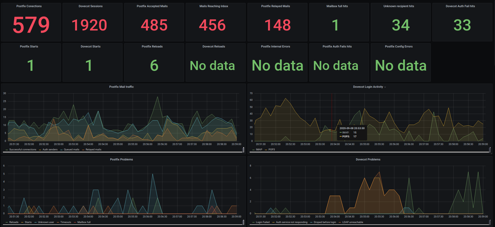

# Mail2Influx

A simple mail log data parser and influx data injector. It can parse any log generated by postfix & dovecot, even from giants as Proxmox Mail Gateway and Zimbra.

## Motivation

Telegraf and other solutions do not fill my needs of mail monitoring, so I put python3 and some regex rules to make this parser, it's given as a GPL 3.0 software, so no warranty in you use case; but you can modify it to fit your needs.

## Installation

You need to install python-influxdb support, search it on the repository or use pip for that.

And no, you don't need to create the influxdb database in advance, mail2influx take care of that too, just be sure to name it as your wish in the user variables in the header of the script. 

0. Clone this repository to somewhere in you PC `git clone https://github.com/stdevPavelmc/mail2influx && cd mail2influx` 
1. Copy the "mail2influx.py" script to `/usr/local/bin/`
2. Make it executable `chmod +x /usr/local/bin/mail2influx.py`
3. Edit the `/usr/local/bin/mail2influx.py` file and change:
    - The variable named `influxhost` to your influxdb server ip/name.
    - The variable named `influxdb` if you want to name the influxdb with other name.
4. Copy "mail2influx.service" file to the systemd folder `cp mail2influx.service /lib/systemd/system/`
5. Activate and start the service.
    - `systemctl daemon-reload`
    - `systemctl enable mail2influx`
    - `systemctl start mail2influx`
6. Go to Grafana and create a new dashboard and import the data from the `influx-grafana_dashboard.json` file
    - The dashboard has a default datasource named **InfluxDB-mail**, you may need to update the influxdb source in grafana to make it work.

## Known issues

- No authentication against the influxdb, no need on my env
- No ssl/tls against the influxdb, no need on my env
- May contain bugs (code is a work in progress)
- May not be 100% optimized

## About the author

This is free software, see [stdevPavelmc](https://github.com/stdevPavelmc/stdevPavelmc)
